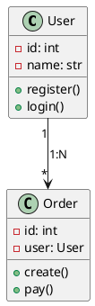
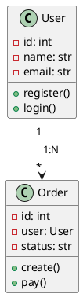
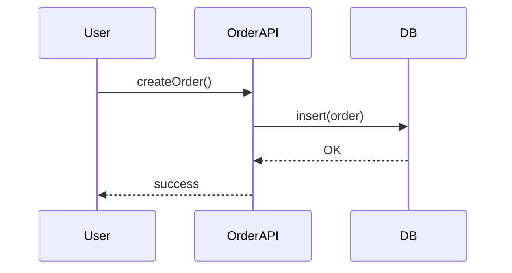
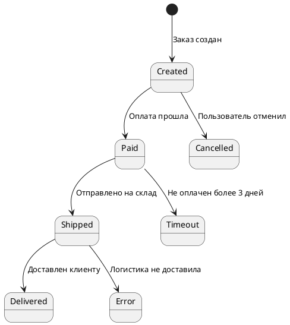

# 7.26 Виды диаграмм UML — выбор инструмента для описания системы

---

## 📌 Короткий ответ

> **UML-диаграммы** — это стандартные способы визуального описания систем. Есть 9 основных типов: **структурные** (классы, объекты, компоненты) и **поведенческие** (последовательность, активность). Выбор зависит от того, что нужно показать: структуру системы или её поведение во времени.

---

## 💡 Простыми словами

### Аналогия с интернет-магазином

| Тип диаграммы | Что показывает | Пример из жизни |
|---------------|----------------|-----------------|
| **Классовая** | Структура данных и их связи | Таблицы БД: пользователи, заказы, товары |
| **Последовательности** | Как система работает во времени | Пользователь → нажал "Купить" → пришло уведомление |
| **Активности (BPMN)** | Бизнес-процессы | Процесс оформления заказа от начала до конца |
| **Компонентная** | Из чего состоит система | Сервисы: Catalog, Cart, Payment, Order |

### Что такое UML?

> **UML** (Unified Modeling Language) — это язык для описания программных систем на диаграммах. Аналитики используют его, чтобы показать разработчикам и заказчику, как должна работать система.

---

## 🔍 Подробно

### Две большие группы UML-диаграмм

#### 1. **Структурные диаграммы** (Static)
Показывают **что есть в системе** — структуру данных, компоненты, их связи.

| Диаграмма | Что показывает | Когда использовать |
|-----------|----------------|-------------------|
| **Классовая** | Классы, атрибуты, методы, связи между ними | Проектирование БД, структура кода |
| **Объектная** | Объекты в конкретный момент времени | Анализ текущих данных в системе |
| **Компонентная** | Из чего состоит система (модули) | Архитектура приложения |
| **Развёртывания** | Где компоненты размещены физически | Инфраструктура, серверы |

#### 2. **Поведенческие диаграммы** (Dynamic)
Показывают **как система работает во времени** — процессы, взаимодействия.

| Диаграмма | Что показывает | Когда использовать |
|-----------|----------------|-------------------|
| **Последовательности** | Взаимодействие объектов по времени | Как пользователь взаимодействует с системой |
| **Активности (BPMN)** | Бизнес-процессы и логику | Бизнес-правила, процессы |
| **Состояний** | Состояния объекта и переходы между ними | Статусы заказов, этапы обработки |

---

### 1. Классовая диаграмма (Class Diagram)

#### Что показывает:
- **Классы**: сущности системы (Пользователь, Заказ, Товар)
- **Атрибуты**: свойства классов (id, name, email)
- **Методы**: действия классов (register(), createOrder())
- **Связи между классами**: 1:N, N:M и т.д.

#### Пример из интернет-магазина:

```
┌─────────────┐       ┌─────────────┐       ┌─────────────┐
│   User      │       │    Order    │       │   Product   │
├─────────────┤       ├─────────────┤       ├─────────────┤
│ - id: int   │◄──────│ - id: int   │       │ - id: int   │
│ - name: str │ 1:N   │ - user: User│       │ - title: str│
│ - email: str│       │ - items: List│      │ - price: float│
├─────────────┤       ├─────────────┤       ├─────────────┤
│ + register()│       │ + create()  │       │ + addToCart()│
│ + login()   │       │ + pay()     │       │ + getStock() │
└─────────────┘       └─────────────┘       └─────────────┘
```

**Связи:**
- **User → Order**: один пользователь может иметь много заказов (1:N)
- **Order → Product**: заказ содержит товары (N:M через таблицу OrderItems)

#### Когда использовать:
- Проектирование базы данных
- Описание структуры кода
- Показ отношений между сущностями
- Документирование системы для разработчиков

---

### 2. Диаграмма последовательностей (Sequence Diagram)

#### Что показывает:
- **Взаимодействие объектов во времени**
- **Последовательность сообщений** между объектами
- **Условия ветвления** (если/иначе)

#### Пример из интернет-магазина:

```
┌─────────────┐     ┌─────────────┐     ┌─────────────┐     ┌─────────────┐
│   User      │     │  OrderAPI   │     │    DB       │     │ PaymentAPI  │
└─────────────┘     └─────────────┘     └─────────────┘     └─────────────┘
       │                  │                   │                   │
       │ register()       │                   │                   │
       ├──────────────────►                   │                   │
       │                   │                   │                   │
       │                   │ createOrder()    │                   │
       │                   ├──────────────────►                   │
       │                   │                   │ insert()         │
       │                   │                   ├─────────────────►│
       │                   │                   │ ← OK            │
       │                   │◄──────────────────┤                   │
       │                   │                   │                   │ charge()
       │                   │                   │                   ├──────────────►
       │                   │                   │                   │ ← success
       │                   │                   │◄─────────────────┤
       │                   │◄──────────────────┤                   │
       │← createOrderSuccess()                 │                   │
```

**Элементы диаграммы:**
- **Вертикальные линии (lifelines)** — объекты системы
- **Горизонтальные стрелки (messages)** — вызовы методов/сообщения
- **Активные области (activation bars)** — время выполнения операции
- **Условия (alt/opt fragments)** — ветвление логики

#### Когда использовать:
- Показывать сценарий работы системы
- Документировать API взаимодействия
- Объяснять разработчикам, как работает функция
- Анализировать поток данных между сервисами

---

### 3. Диаграмма активностей (Activity Diagram)

#### Что показывает:
- **Бизнес-процессы** и логику выполнения
- **Ветвление** и слияние потоков
- **Последовательность действий**

**Примечание:** В BPMN диаграммы называются "BPMN", но они аналогичны UML Activity Diagrams.

#### Пример из интернет-магазина:

```
┌─────────────┐     ┌─────────────┐     ┌─────────────┐
│Начало       │───►│ Создать     │───►│ Проверка    │
│пользователя │    │   заказ     │    │ оплаты       │
└─────────────┘     └─────────────┘     └──────┬──────┘
                                               ├─ Оплачено → Отправить на склад
                                               └─ Не оплачено → Отменить заказ
```

#### Когда использовать:
- Описывать бизнес-процессы
- Показывать логику принятия решений
- Документировать workflow системы
- Анализировать процессы для оптимизации

---

### 4. Диаграмма состояний (State Machine Diagram)

#### Что показывает:
- **Состояния объекта** и переходы между ними
- **Условия перехода** из одного состояния в другое
- **Исторические состояния** (возврат к предыдущему состоянию)

#### Пример из интернет-магазина — статус заказа:

```
┌─────────────┐     ┌─────────────┐     ┌─────────────┐     ┌─────────────┐
│  Created    │───►│   Paid      │───►│ Shipped      │───►│ Delivered   │
│ (создан)    │     │ (оплачен)   │     │ (отправлен)  │     │ (доставлен) │
└─────────────┘     └─────────────┘     └─────────────┘     └─────────────┘
       ▲                  │                   │                   │
       │                  │                   │                   │
       │ cancelled        │ timeout           │ error             │ success
       │ (пользователь)   │ (3 дня без оплаты)│ (логистика)      │ (клиент получил)
```

**Состояния заказа:**
1. **Created** — заказ создан, ждёт оплаты
2. **Paid** — оплата прошла, ждёт отправки на склад
3. **Shipped** — отправлен на доставку
4. **Delivered** — доставлен клиенту (конечное состояние)

**Переходы:**
- Created → Paid: "Оплата прошла"
- Created → Cancelled: "Пользователь отменил заказ"
- Paid → Shipped: "Отправлено на склад"
- Paid → Timeout: "Не оплачен более 3 дней" (автоматическая отмена)

#### Когда использовать:
- Описывать жизненный цикл объекта
- Показывать все возможные состояния системы
- Документировать статусы в БД
- Проектировать логику обработки ошибок

---

### 5. Компонентная диаграмма (Component Diagram)

#### Что показывает:
- **Из чего состоит система** (компоненты/модули)
- **Связи между компонентами**
- **Интерфейсы компонентов**

#### Пример из интернет-магазина:

```
┌─────────────┐     ┌─────────────┐     ┌─────────────┐
│  Catalog    │◄───┤   OrderAPI  │◄───┤ PaymentAPI   │
│ Service     │     │             │     │             │
└─────────────┘     └─────────────┘     └─────────────┘
       ▲                  │                   │
       │                  │                   │
       │                  ▼                   ▼
    ┌─────────────┐  ┌─────────────┐  ┌─────────────┐
    │   Redis     │  │   PostgreSQL│  │ Stripe API  │
    │ (кэш)       │  │   (БД)      │  │             │
    └─────────────┘  └─────────────┘  └─────────────┘
```

**Компоненты:**
- **Catalog Service**: каталог товаров
- **Order API**: обработка заказов
- **Payment API**: платежи
- **Redis**: кэш данных
- **PostgreSQL**: база данных
- **Stripe API**: внешняя система платежей

#### Когда использовать:
- Показывать архитектуру системы
- Документировать микросервисы
- Объяснять разработчикам, из чего состоит приложение
- Планировать масштабирование

---

### 6. Диаграмма развёртывания (Deployment Diagram)

#### Что показывает:
- **Физическое размещение компонентов** на серверах/устройствах
- **Сети и соединения** между узлами
- **Конфигурацию инфраструктуры**

#### Пример из интернет-магазина:

```
┌─────────────────┐     ┌─────────────────┐     ┌─────────────────┐
│   Load Balancer │────►│   Web Server    │◄───┤  Database       │
│   (Nginx)       │     │   (Docker)      │     │   Cluster       │
└─────────────────┘     └─────────────────┘     └─────────────────┘
         ▲                     │
         │                      ▼
         │             ┌─────────────────┐
         │             │   Cache Server  │
         │             │   (Redis)       │
         │             └─────────────────┘
         │
         ▼
    ┌──────────────┐
    │ External API │
    │ (Stripe)     │
    └──────────────┘
```

**Узлы:**
- **Load Balancer**: распределяет нагрузку между серверами
- **Web Server**: обрабатывает HTTP запросы
- **Database Cluster**: кластер баз данных для отказоустойчивости
- **Cache Server**: кэш для ускорения доступа к данным
- **External API**: внешние сервисы (платежи, доставка)

#### Когда использовать:
- Документировать инфраструктуру
- Показывать конфигурацию серверов
- Планировать развертывание системы
- Объяснять DevOps-инженерам архитектуру

---

### 7. Объектная диаграмма (Object Diagram)

#### Что показывает:
- **Конкретные объекты** в определённый момент времени
- **Значения атрибутов** этих объектов
- **Связи между объектами**

#### Пример из интернет-магазина:

```
User[1] ────────┐
  id: 123       │
  name: "Иван"  │
  email: "ivan@mail.ru"
                 │
Order[1] ────────┼──────────────────────────────────────────────────┐
  id: 456        │                                                  │
  user: User[1]  │                                                  │
  status: "Paid" │                                                  │
  total: 2500    │                                                  │
                 │                                                  │
OrderItems[3] ──┼──────────────────────────────────────────────────┤
  id: 789       │                                                  │
  order: Order[1]│                                                  │
  product: "Book"│                                                  │
  quantity: 2    │                                                  │
                 │                                                  │
OrderItems[4] ──┼──────────────────────────────────────────────────┤
  id: 890       │                                                  │
  order: Order[1]│                                                  │
  product: "Pen" │                                                  │
  quantity: 5    │                                                  │
                 │                                                  │
OrderItems[5] ──┼──────────────────────────────────────────────────┤
  id: 901       │                                                  │
  order: Order[1]│                                                  │
  product: "Notebook"│                                             │
  quantity: 3    │                                                  │
```

**Пример конкретного состояния:**
- Один пользователь (id=123)
- У него один заказ (id=456, статус "Paid")
- В заказе три товара (книга x2, ручка x5, блокнот x3)

#### Когда использовать:
- Показывать конкретный срез данных в БД
- Иллюстрировать пример из классовой диаграммы
- Анализировать текущее состояние системы
- Отладка и поиск проблем

---

### Сравнительная таблица UML-диаграмм

| Диаграмма | Статическая/Динамическая | Что показывает | Когда использовать |
|-----------|-------------------------|----------------|-------------------|
| **Классовая** | Статическая | Структура данных и связи | Проектирование БД, структура кода |
| **Объектная** | Статическая | Конкретные объекты в момент времени | Анализ текущих данных |
| **Компонентная** | Статическая | Из чего состоит система | Архитектура приложения |
| **Развёртывания** | Статическая | Физическое размещение компонентов | Инфраструктура, серверы |
| **Последовательности** | Динамическая | Взаимодействие объектов по времени | Сценарии работы системы |
| **Активности (BPMN)** | Динамическая | Бизнес-процессы и логику | Бизнес-правила, процессы |
| **Состояний** | Динамическая | Состояния объекта и переходы | Жизненный цикл объектов |

---

### Когда какую диаграмму использовать?

#### Для аналитика:

| Задача | Диаграмма | Почему |
|--------|-----------|--------|
| "Нужно спроектировать БД" | Классовая | Показывает сущности и связи |
| "Хочу показать заказчику, как работает процесс" | Активности/BPMN | Визуально понятно, где ветвление |
| "Нужно документировать API взаимодействия" | Последовательности | Показывает последовательность вызовов |
| "Хочу описать статусы заказа" | Состояний | Все возможные состояния и переходы |
| "Нужно показать архитектуру микросервисов" | Компонентная | Из чего состоит система |
| "Хочу объяснить DevOps инфраструктуру" | Развёртывания | Где что размещено физически |

---

### Антипаттерны при использовании UML

#### ❌ Ошибка 1: Слишком много диаграмм

**Плохо:** Создать все 9 типов диаграмм для простой системы.

```
Простой интернет-магазин из 10 функций:
→ Классовая диаграмма (50 классов)
→ Последовательности (20 сценариев)
→ Активности (3 процесса)
→ Состояния (4 объекта)
→ Компонентная (8 компонентов)

Результат: 100+ страниц документации, никто не читает! ❌
```

**Хорошо:** Использовать только нужные диаграммы.

```
Простой интернет-магазин из 10 функций:
→ Классовая диаграмма (3 сущности)
→ Активности (1 процесс оформления заказа)
→ Состояния (статусы заказа)

Результат: 5 страниц документации, всё понятно! ✅
```

---

#### ❌ Ошибка 2: Путаница между BPMN и Activity Diagram

**Плохо:** Использовать UML Activity Diagram вместо BPMN для бизнес-процессов.

```
Activity Diagram (UML):
┌─────────────┐     ┌─────────────┐     ┌─────────────┐
│Начало       │───►│ Действие 1   │───►│ Действие 2   │
│пользователя │    │             │    │             │
└─────────────┘     └─────────────┘     └─────────────┘

BPMN:
┌─────────────┐     ┌─────────────┐     ┌─────────────┐
│Начало       │───►│   Шлюз XOR   │───►│ Действие 2   │
│пользователя │    │ "Успех?"     │    │             │
└─────────────┘     └──────┬──────┘    └─────────────┘
                           ├─ Нет → Отмена заказа

BPMN лучше показывает ветвление и условия! ✅
```

---

#### ❌ Ошибка 3: Диаграмма последовательности без условий

**Плохо:** Показать только один сценарий, не учитывая альтернативы.

```
Пользователь → Нажал "Купить" → Пришло уведомление
→ Всё работает идеально! ✅

Но что если:
❌ Оплата не прошла?
❌ Товара нет на складе?
❌ Пользователь отменил заказ?

Нужно показать все сценарии, включая ошибки! ❌
```

**Хорошо:** Добавить условия и альтернативные пути.

```
Пользователь → Нажал "Купить" → Проверка оплаты
├─ Оплачено → Пришло уведомление ✅
└─ Не оплачено → Уведомление об ошибке ❌

Пользователь → Нажал "Купить" → Проверка наличия товара
├─ Есть → Пришло уведомление ✅
└─ Нет → Предложение аналогов ❌
```

---

## ⚖️ Плюсы и минусы UML-диаграмм

### ✅ Плюсы

| Преимущество | Объяснение | Пример из жизни |
|-------------|------------|-----------------|
| **Стандарт** | Все разработчики понимают UML | Разработчик из другой команды поймёт диаграмму |
| **Визуальность** | Легче читать, чем текст | Заказчику проще понять диаграмму, чем документацию |
| **Документирование** | Система задокументирована для будущих разработчиков | Через год новый разработчик найдёт диаграммы и поймёт систему |
| **Обнаружение проблем** | На диаграмме видно логические ошибки | "Ой, здесь нет перехода из состояния А в состояние Б!" |

### ❌ Минусы

| Недостаток | Объяснение | Пример из жизни |
|-----------|------------|-----------------|
| **Время на создание** | Нужно время для рисования диаграмм | 2 часа на классовой диаграмму вместо написания кода |
| **Устаревание** | Диаграмма быстро становится неактуальной | Изменил структуру → забыл обновить диаграмму → она вводит в заблуждение |
| **Сложность для новичков** | Нужно понимать нотацию UML | Разработчик без опыта не поймёт, что означает ромб с крестом |

---

## 🎯 Что важно запомнить аналитику

### 1. Выбирайте диаграмму по задаче
> Не рисуйте все типы диаграмм сразу! Сначала определите: **что нужно показать?** — структуру (классовая) или поведение (последовательности)?

**Пример:**
- Нужно спроектировать БД → Классовая диаграмма
- Нужно показать заказчику процесс → Активности/BPMN
- Нужно документировать API → Последовательности

---

### 2. UML — это инструмент коммуникации, а не самоцель
> Диаграммы должны помогать понимать систему, а не усложнять её. Если команда тратит больше времени на рисование диаграмм, чем на работу → упростите или откажитесь от них.

**Хорошо:**
```
5 минут: Нарисовал последовательность для API → разработчик понял логику
```

**Плохо:**
```
2 дня: Рисую классовой диаграмму с 100+ классами → никто не читает!
```

---

### 3. Актуальность важнее красоты
> Устаревшая диаграмма хуже, чем её отсутствие. Если изменили систему — обновите диаграммы или удалите их.

**Как поддерживать актуальность:**
- Обновляйте диаграммы вместе с кодом (через commit)
- Используйте инструменты автоматической генерации (PlantUML, Mermaid)
- Удаляйте устаревшие диаграммы из документации

---

### 4. Не используйте UML для всего подряд
> Для простых систем достаточно простых схем без формальной нотации.

**Пример:**
```
Сложная система (банк):
→ Полноценные UML-диаграммы с соблюдением всех правил

Простой сайт-визитка:
→ Простая схема, не обязательно UML
```

---

### 5. BPMN — это подмножество Activity Diagrams
> BPMN диаграммы можно считать активностными диаграммами с расширенной нотацией для бизнес-процессов. Используйте BPMN для процессов, а UML Activity Diagrams — для внутренней логики кода.

---

## ❓ Типичные вопросы и ответы

### Вопрос 1: Что такое UML и зачем он нужен аналитику?

**Ответ:**
> **UML (Unified Modeling Language)** — это стандартный язык для описания программных систем на диаграммах. Аналитики используют его, чтобы показать разработчикам и заказчику, как должна работать система.

**Зачем нужен аналитику:**
1. **Документирование**: Система задокументирована для будущих разработчиков
2. **Коммуникация**: Визуально понятно всем участникам проекта
3. **Обнаружение проблем**: На диаграмме видно логические ошибки до написания кода
4. **Стандарт**: Все разработчики понимают UML

**Пример:**
```
Аналитик рисует последовательность:
Пользователь → Нажал "Купить" → Проверка оплаты → Уведомление

Разработчик видит:
→ Как работает функция
→ Какие данные передаются между сервисами
→ Где могут быть ошибки
```

---

### Вопрос 2: Когда использовать классовую диаграмму?

**Ответ:**

Используйте **классовую диаграмму**, когда нужно спроектировать структуру данных и их связи.

**Примеры использования:**
1. Проектирование базы данных (таблицы, поля, связи)
2. Описание структуры кода (классы, методы, атрибуты)
3. Показ отношений между сущностями (1:N, N:M)
4. Документирование системы для разработчиков

**Пример из интернет-магазина:**
```
Классовая диаграмма показывает:
→ Таблицы БД: User, Order, Product
→ Связи: один пользователь → много заказов (1:N)
→ Методы: register(), createOrder(), pay()

Это помогает разработчикам понять структуру данных и спроектировать БД!
```

---

### Вопрос 3: В чём разница между диаграммой последовательностей и активностей?

**Ответ:**

| Характеристика | Последовательности (Sequence) | Активности (Activity/BPMN) |
|----------------|------------------------------|--------------------------|
| **Фокус** | Взаимодействие объектов по времени | Бизнес-процессы и логику |
| **Ось X** | Объекты/сервисы | Шаги процесса |
| **Ось Y** | Время (вниз) | Последовательность шагов |
| **Когда использовать** | API взаимодействия, сценарии работы | Бизнес-правила, workflow системы |

**Пример:**
```
Последовательности:
User ──► OrderAPI ──► DB ──► PaymentAPI
(показывает взаимодействие объектов)

Активности/BPMN:
Начало → Создать заказ → Проверка оплаты → Отправка на склад → Конец
(показывает бизнес-процесс)
```

---

### Вопрос 4: Какую диаграмму использовать для статусов заказа?

**Ответ:**

Для статусов заказа использую **диаграмму состояний (State Machine Diagram)**.

**Почему:**
- Нужно показать все возможные состояния объекта (Created, Paid, Shipped...)
- Показать переходы между состояниями и условия перехода
- Документировать логику обработки ошибок

**Пример из интернет-магазина:**
```
Состояния заказа:
Created → Paid → Shipped → Delivered

Переходы:
Paid ← Created (оплата прошла)
Shipped ← Paid (отправлено на склад)
Delivered ← Shipped (доставлен клиенту)

Отдельные переходы для ошибок:
Cancelled ← Created (пользователь отменил)
Timeout ← Paid (не оплачен более 3 дней)
Error ← Shipped (логистика не доставила)
```

---

### Вопрос 5: Как автоматизировать создание UML-диаграмм?

**Ответ:**

Используйте инструменты для **автоматической генерации диаграмм из кода**:

#### Инструменты:
1. **PlantUML** — текстовый язык для рисования диаграмм
2. **Mermaid.js** — встроен в GitHub, GitLab, Notion
3. **Jira + Confluence** — интеграция с диаграммами
4. **IDE plugins** — IntelliJ IDEA, VS Code имеют плагины для UML

**Пример PlantUML (классовая диаграмма):**


**Преимущества:**
- Диаграмма генерируется из текста (легко обновлять)
- Интеграция в документацию (Confluence, GitHub)
- Автоматическое обновление при изменении кода

---

## 🛠 Практические вопросы для собеседования

### Вопрос 1: Заказчик просит "Показать, как работает процесс оформления заказа". Какую диаграмму использовать?

**Ответ:**

Использую **диаграмму активностей (BPMN)**.

**Почему BPMN/Activity Diagram:**
- Нужно показать бизнес-процесс от начала до конца
- Есть ветвления и условия (оплачено/не оплачено)
- Заказчику проще понять процесс, чем техническую последовательность

**Пример диаграммы:**
```
┌─────────────┐     ┌─────────────┐     ┌─────────────┐
│Начало       │───►│ Создать     │───►│ Проверка    │
│пользователя │    │   заказ     │    │ оплаты       │
└─────────────┘     └─────────────┘     └──────┬──────┘
                                               ├─ Оплачено → Отправить на склад
                                               └─ Не оплачено → Отменить заказ
```

**Если нужно показать взаимодействие сервисов:** Использую **диаграмму последовательностей**.

---

### Вопрос 2: Нужно спроектировать БД для интернет-магазина. Какую диаграмму рисуете?

**Ответ:**

Использую **классовую диаграмму (Class Diagram)**.

**Почему классовая диаграмма:**
- Показывает сущности системы (User, Order, Product)
- Отображает связи между ними (1:N, N:M)
- Помогает спроектировать таблицы БД и их поля

**Пример из интернет-магазина:**
```
┌─────────────┐       ┌─────────────┐       ┌─────────────┐
│   User      │       │    Order    │       │   Product   │
├─────────────┤       ├─────────────┤       ├─────────────┤
│ - id: int   │◄──────│ - id: int   │       │ - id: int   │
│ - name: str │ 1:N   │ - user: User│       │ - title: str│
│ - email: str│       │ - items: List│      │ - price: float│
├─────────────┤       ├─────────────┤       ├─────────────┤
│ + register()│       │ + create()  │       │ + addToCart()│
└─────────────┘       └─────────────┘       └─────────────┘

Связи:
User → Order: один пользователь может иметь много заказов (1:N)
Order → Product: заказ содержит товары (N:M через таблицу OrderItems)
```

**Как это превращается в БД:**
- Таблица `users` с полями id, name, email
- Таблица `orders` с полями id, user_id (ссылка на users)
- Таблица `products` с полями id, title, price
- Таблица `order_items` для связи заказов и товаров

---

### Вопрос 3: Как вы объясните заказчику разницу между BPMN и диаграммой последовательностей?

**Ответ:**

Я бы сказал:

> "Представьте, что мы в магазине:
> 
> **BPMN (диаграмма активностей)** — это как карта магазина. Она показывает все отделы и пути между ними: 'Сначала идём к прилавку, потом на кассу, потом в шкафчик'. Это бизнес-процесс от начала до конца.
> 
> **Диаграмма последовательностей** — это как запись разговора с продавцом: 'Клиент спрашивает → Продавец отвечает → Клиент платит → Продавец выдаёт товар'. Это взаимодействие объектов во времени."

**Примеры:**
```
BPMN (процесс):
Начало → Создать заказ → Проверка оплаты → Отправка на склад → Конец

Последовательности (взаимодействие):
User ──► OrderAPI ──► DB ──► PaymentAPI ──► User ← Уведомление
```

---

### Вопрос 4: Как вы тестируете UML-диаграммы?

**Ответ:**

UML-диаграммы не "тестируются" в классическом смысле, но их **валидируют**:

#### Для классовых диаграмм:
1. Проверяю соответствие БД (таблицы и связи)
2. Проверяю покрытие всех сущностей системы
3. Проверяю корректность связей (нормализация данных)

**Пример:**
```
Классовая диаграмма показывает 5 классов:
✓ Таблица users создана
✓ Таблица orders создана
✓ Связь user_id в таблице orders есть
→ Диаграмма соответствует БД! ✅
```

#### Для последовательностей:
1. Проверяю, что все сценарии протестированы (успех/ошибка)
2. Проверяю корректность передачи данных между объектами
3. Проверяю обработку исключений

**Пример:**
```
Последовательности показывает 3 сценария:
✓ Сценарий "Успех" протестирован
✓ Сценарий "Ошибка оплаты" протестирован
✓ Сценарий "Товара нет" протестирован
→ Все сценарии покрыты! ✅
```

#### Для состояний:
1. Проверяю, что все состояния реализованы в коде
2. Проверяю корректность переходов между состояниями
3. Проверяю обработку ошибок перехода

**Пример:**
```
Диаграмма состояний показывает 5 статусов заказа:
✓ Created — реализован в БД
✓ Paid — реализован в БД
✓ Shipped — реализован в БД
✓ Delivered — реализован в БД
✓ Cancelled — реализован в БД
→ Все состояния покрыты! ✅
```

---

### Вопрос 5: Какие метрики можно вывести из UML-диаграмм?

**Ответ:**

Из UML-диаграмм можно получить несколько полезных метрик:

#### Для классовых диаграмм:
1. **Сложность системы (Cyclomatic Complexity)**
> Количество связей между классами → сложность архитектуры
```
Классовая диаграмма показывает 20 классов и 50 связей
→ Сложная система! Нужно упростить?
```

2. **Покрытие сущностей**
> Сколько процентов всех бизнес-объектов задокументировано
```
Всего бизнес-объектов: 15
Задокументировано в диаграмме: 10
Coverage: 67% ⚠️ (нужно добавить остальные!)
```

#### Для последовательностей:
3. **Покрытие сценариев**
> Сколько процентов всех возможных путей протестировано
```
Всего сценариев через условия: 8
Протестировано: 6
Coverage: 75% ✅
```

4. **Количество взаимодействий между сервисами**
> Сколько API вызовов в среднем на один сценарий
```
Среднее количество API вызовов: 12
→ Много зависимостей! Нужно упростить?
```

#### Для состояний:
5. **Количество переходов**
> Сколько возможных путей через состояния
```
Диаграмма состояний показывает 10 переходов
→ Сложная логика! Упрощаем?
```

6. **Точки отказа (Failure Points)**
> Где процесс может завершиться ошибкой
```
Конечные события "Ошибка": 3 точки
→ Нужно добавить больше граничных событий для обработки ошибок?
```

---

## 📊 Шаблон UML-диаграмм для использования

### Классовая диаграмма (PlantUML):


### Диаграмма последовательностей (Mermaid):


### Диаграмма состояний (PlantUML):


---

## 📚 Связанные темы

- **7.9. Пример BPMN регистрации пользователя** — полный пример диаграммы с событиями
- **10.1. ООП (объектно-ориентированное программирование)** — связь классовых диаграмм и ООП
- **2.14. Виды связей в реляционных БД** — связи на классовой диаграмме

---

## 🔗 Перекрёстные ссылки

| Тема | Связь | Почему важно знать вместе |
|-----|-------|--------------------------|
| 7.9. Пример BPMN регистрации пользователя | ↔️ | Практический пример использования UML-диаграмм |
| 10.1. ООП (объектно-ориентированное программирование) | ↔️ | Классовые диаграммы описывают ООП структуру |
| 2.14. Виды связей в реляционных БД | ↔️ | Связи на классовой диаграмме соответствуют связям в БД |

---

**Создано:** 05 сентября 2026  
**Обновлено:** 05 сентября 2026  
**Автор:** Преподаватель системного анализа