# 7.27 Фреймы в Sequence-диаграмме — операторы ветвления, циклов и параллельности

---

## 📌 Короткий ответ

> **Фреймы в Sequence-диаграмме** — это рамки вокруг части диаграммы с пометками: `alt` (если/иначе), `opt` (необязательно), `loop` (цикл), `par` (параллельно), `ref` (ссылка на другую диаграмму). Они организуют логику и делают последовательность понятной.

---

## 💡 Простыми словами

### Аналогия с интернет-магазином

| Фрейм | Как работает | Пример из магазина |
|-------|--------------|---------------------|
| **alt** (if/else) | Либо так, либо так | "Если оплата прошла → отправить чек. Иначе → показать ошибку" |
| **opt** (optional) | Может быть или не быть | "Покупатель может добавить промокод (но не обязан)" |
| **loop** (iteration) | Повторяется N раз | "Запрашивать товар до тех пор, пока он будет в наличии" |
| **par** (parallel) | Происходит одновременно | "Отправить уведомление клиенту И обновить статус заказа параллельно" |
| **ref** (include/import) | Ссылка на другую диаграмму | "Здесь ссылка на детализацию процесса оплаты из другой схемы" |

### Что такое фреймы?

> **Фреймы** — это визуальные рамки с текстовыми метками, которые организуют логику внутри Sequence-диаграммы. Они не меняют порядок сообщений, а показывают условия и повторения.

---

## 🔍 Подробно

### 5 основных типов фреймов

#### 1. `alt` (альтернатива / if/else)

**Что это:** Ветвление с условиями — либо один путь, либо другой.

**Как работает:**
- Внутри рамки есть несколько вариантов
- Реализуется только **один** из них в зависимости от условия
- Варианты идут сверху вниз

**Синтаксис PlantUML:**
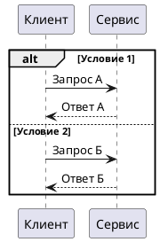

**Пример из интернет-магазина:**
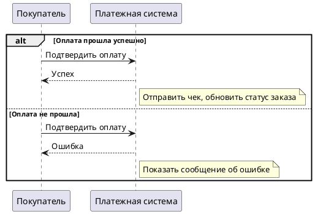

**Когда использовать:**
- ✅ Есть взаимоисключающие варианты логики
- ✅ Нужно показать условия "если/иначе"
- ❌ Не для всех возможных вариантов (только альтернативные)

---

#### 2. `opt` (опционально / optional)

**Что это:** Необязательный блок — может выполниться или нет, но не имеет условий выбора.

**Как работает:**
- Блок **может** выполниться один раз
- Или вообще пропустить этот блок
- Не требует условий (в отличие от alt)

**Синтаксис PlantUML:**
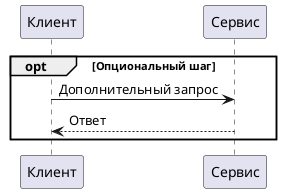

**Пример из интернет-магазина:**
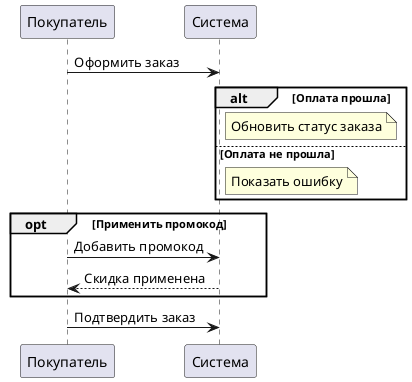

**Когда использовать:**
- ✅ Есть дополнительный шаг, который может быть пропущен
- ❌ Не для ветвлений с условиями (это alt)
- ❌ Не для циклов (это loop)

---

#### 3. `loop` (итерация / цикл)

**Что это:** Повторение блока N раз или пока условие истинно.

**Как работает:**
- Блок выполняется **N раз** (если указано число)
- Или повторяется **пока условие истинно**
- После выполнения — выход из рамки

**Синтаксис PlantUML:**
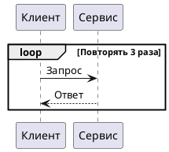

**Пример из интернет-магазина:**
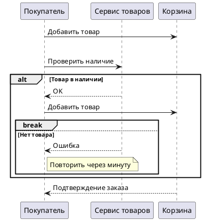

**Когда использовать:**
- ✅ Есть цикл с фиксированным числом итераций
- ✅ Нужно показать повторение "пока условие истинно"
- ❌ Не для одиночных действий без повторов

---

#### 4. `par` (параллельно / parallel)

**Что это:** Несколько действий выполняются **одновременно**.

**Как работает:**
- Все ветки внутри рамки запускаются параллельно
- После выполнения всех веток — выход из рамки
- Важно: все ветки должны завершиться, чтобы выйти

**Синтаксис PlantUML:**
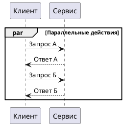

**Пример из интернет-магазина:**
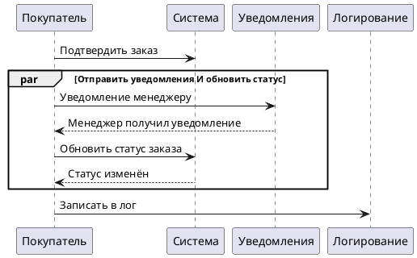

**Когда использовать:**
- ✅ Действия действительно выполняются параллельно (не последовательно)
- ❌ Не для действий, которые должны завершиться одно за другим
- ⚠️ Важно понимать реальную архитектуру системы

---

#### 5. `ref` (ссылка / reference/import)

**Что это:** Ссылка на другую диаграмму или фрагмент логики.

**Как работает:**
- Не описывает логику полностью
- Ссылается на уже существующую диаграмму
- Позволяет избежать дублирования

**Синтаксис PlantUML:**
```plantuml
@startuml
participant "Клиент" as Client
participant "Сервис" as Service

ref include: "process_payment.puml" as PaymentProcess
Client -> PaymentProcess: Инициировать оплату
PaymentProcess --> Client: Оплата завершена
@enduml
```

**Пример из интернет-магазина:**
```plantuml
@startuml
participant "Покупатель" as Buyer
participant "Сервис заказов" as OrderService
ref include: "process_payment.puml" as Payment

Buyer -> OrderService: Создать заказ
OrderService --> Buyer: Заказ создан

Buyer -> OrderService: Оплатить заказ
OrderService -> Payment: Инициировать оплату
Payment --> OrderService: Оплата прошла
OrderService --> Buyer: Подтверждение заказа
@enduml
```

**Когда использовать:**
- ✅ Есть повторяющаяся логика в разных диаграммах
- ✅ Нужно избежать дублирования кода
- ❌ Не для уникальной логики, которая встречается один раз

---

### Сравнительная таблица фреймов

| Фрейм | Аналог программирования | Когда использовать | Пример из магазина |
|-------|------------------------|--------------------|---------------------|
| **alt** | if/else | Ветвление по условиям | "Если оплата прошла → чек, иначе → ошибка" |
| **opt** | if (без условия) | Опциональный шаг | "Покупатель может добавить промокод" |
| **loop** | for / while | Повторение | "Запрашивать товар до успеха" |
| **par** | parallel execution | Параллельные действия | "Отправить уведомление И обновить статус" |
| **ref** | include/import | Ссылка на другую диаграмму | "Ссылка на процесс оплаты из другой схемы" |

---

### Нюансы и особенности

#### 1. Вложенность фреймов

Фреймы можно вкладывать друг в друга:

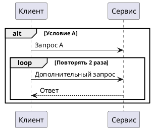

#### 2. Сочетание с другими операторами

Фреймы часто сочетаются с `break` (выход из цикла):

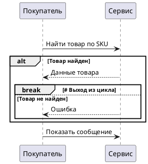

#### 3. Реальные ограничения

- **`par`** требует, чтобы все ветки завершились перед выходом из рамки
- **`loop`** с числом итераций гарантирует конечное выполнение
- **`alt`** всегда выбирает первый истинный вариант (не проверяет все)

---

### Шаблон для использования

#### Базовый шаблон PlantUML:

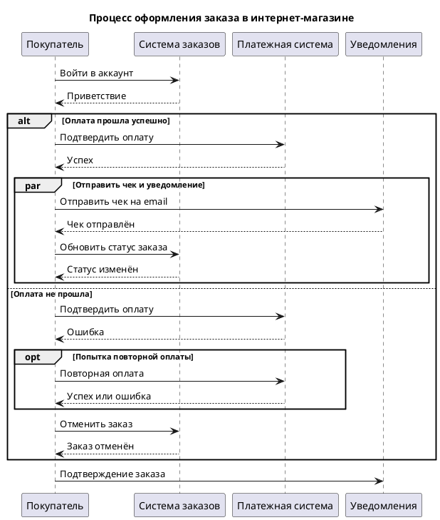

#### Советы по оформлению:

1. **Используйте `alt` для взаимоисключающих вариантов** (оплата прошла / не прошла)
2. **Используйте `opt` для дополнительных опций** (промокод, бонусная программа)
3. **Используйте `loop` только при реальных циклах** (повторные запросы, ретрай)
4. **Используйте `par` только когда действия действительно параллельны** (не путайте с последовательностью)
5. **Используйте `ref` для повторяющейся логики** (процесс оплаты, отправка уведомлений)

---

## ⚖️ Плюсы и минусы фреймов

### ✅ Плюсы использования фреймов

| Преимущество | Объяснение | Пример из жизни |
|-------------|------------|-----------------|
| **Читаемость диаграммы** | Логика структурирована, не запутана | Вместо 50 строк сообщений — 3 рамки с условиями |
| **Понятность условий** | Сразу видно "если/иначе", циклы | Менеджер видит: "оплата прошла → чек" без чтения всего процесса |
| **Переиспользование логики** | Ссылка на другие диаграммы | Процесс оплаты используется в разных сценариях |
| **Параллельность видна сразу** | Параллельные ветки очевидны | "Уведомление И обновление статуса" — видно что одновременно |

### ❌ Минусы и ограничения

| Недостаток | Объяснение | Пример из жизни |
|-----------|------------|-----------------|
| **Сложность для новичков** | Нужно понимать нотацию UML | Новичок может не понять разницу между alt и opt |
| **Не все инструменты поддерживают** | Некоторые редакторы схем ограничены | В Draw.io нет полной поддержки всех фреймов |
| **Может усложнять диаграмму** | Слишком много рамок → запутанность | 10 вложенных alt/loop → непонятно что происходит |
| **Не для всех задач** | Простые процессы не требуют фреймов | "Клиент делает заказ" — достаточно простой последовательности |

---

## 🎯 Что важно запомнить аналитику

### Ключевые выводы:

1. **alt ≠ opt:**
   - `alt` — есть условия, выбирается один вариант (if/else)
   - `opt` — может быть или нет, без условий (опциональный шаг)

2. **loop для циклов:**
   - Фиксированное число итераций: `loop Повторять 3 раза`
   - По условию: `loop Пока товар не найден`
   - Можно использовать `break` для выхода из цикла

3. **par только для реального параллелизма:**
   - Действия действительно выполняются одновременно
   - Не путайте с последовательными действиями "сделать А, потом Б"

4. **ref для переиспользования:**
   - Ссылка на другую диаграмму
   - Избегайте дублирования логики в разных схемах

5. **Вложенность возможна:**
   - `alt` внутри `loop`, `opt` внутри `par` и т.д.
   - Но не переусердствуйте с глубиной

---

## ❓ Типичные вопросы и ответы

### Вопрос 1: Чем alt отличается от opt?

**Ответ:**
- **alt (альтернатива)** — это ветвление по условиям, где выбирается один из нескольких вариантов. Например: "Если оплата прошла → отправить чек. Иначе → показать ошибку".
- **opt (опционально)** — это необязательный блок, который может выполниться или нет, но не имеет условий выбора. Например: "Покупатель может добавить промокод" (но не обязан).

**Ключевое различие:** alt требует условия и выбирает один вариант, opt просто может быть пропущен без проверки условий.

---

### Вопрос 2: Когда использовать loop вместо опционального блока?

**Ответ:**
- **loop** — когда действие повторяется N раз или пока условие истинно. Пример: "Запрашивать товар до тех пор, пока он будет в наличии (макс 5 попыток)".
- **opt** — когда действие может выполниться один раз или вообще не выполниться. Пример: "Покупатель может добавить промокод" (не повторяется).

**Ключевое различие:** loop подразумевает повторение, opt — единичное опциональное действие.

---

### Вопрос 3: Что означает ref в фреймах?

**Ответ:**
- **ref** — это ссылка на другую диаграмму или фрагмент логики. Позволяет избежать дублирования повторяющейся логики.
- Пример: процесс оплаты используется в разных сценариях (оформление заказа, возврат товара). Вместо того чтобы рисовать его каждый раз, вы ставите `ref include: "process_payment.puml"`.

**Ключевое различие:** ref не описывает логику внутри текущей диаграммы, а ссылается на уже существующую схему.

---

### Вопрос 4: Можно ли использовать par для последовательных действий?

**Ответ:**
- **Нет!** `par` означает параллельное выполнение — все ветки запускаются одновременно и завершаются только после того, как все ветки закончатся.
- Если действия должны выполняться последовательно (сначала А, потом Б), используйте простую стрелку без рамки par.

**Пример ошибки:**
```plantuml
par Последовательные действия  # ❌ Неправильно!
    Action A
    Action B  # Выполнится после A, а не параллельно
end
```

---

### Вопрос 5: Как правильно вложить фреймы друг в друга?

**Ответ:**
Вложенность возможна, но следуйте принципам:
1. **Начинайте с внешнего уровня:** alt → loop → par (или наоборот, в зависимости от логики)
2. **Не переусердствуйте с глубиной:** 3-4 уровня вложенности — максимум
3. **Каждый фрейм должен иметь смысл:** не добавляйте рамки просто для красоты

**Пример правильной вложенности:**
```plantuml
alt Условие A (внешний уровень)
    loop Повторять N раз (средний уровень)
        par Параллельные действия (внутренний уровень)
            Action 1
            Action 2
        end
    end
end
```

---

## 📝 Практические вопросы для собеседования

### Вопрос 1: Объясните, как фреймы помогают сделать Sequence-диаграмму понятной?

**Ожидаемый ответ:**
Фреймы организуют логику внутри Sequence-диаграммы и делают её читаемой без необходимости читать каждое сообщение. Например:
- **alt** показывает условия "если/иначе" — менеджер сразу видит альтернативные сценарии (оплата прошла / не прошла)
- **loop** показывает циклы — видно что есть повторение действий (ретрай запросов, ожидание ответа)
- **par** показывает параллельность — понятно какие действия выполняются одновременно

Без фреймов диаграмма превращается в длинную последовательность стрелок, где не очевидно какие ветки альтернативные, а какие повторяющиеся. Фреймы добавляют контекст и структуру.

---

### Вопрос 2: В интернет-магазине есть процесс оплаты с ретрай (повторной попыткой). Как это отобразить в Sequence?

**Ожидаемый ответ:**
Используйте комбинацию `loop` и `alt`:

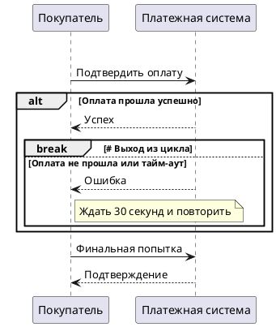

**Ключевые моменты:**
- `loop` показывает что есть повторение (макс 3 попытки)
- `alt` внутри loop разделяет успешный и неуспешный сценарии
- `break` показывает выход из цикла при успехе

---

### Вопрос 3: Есть ли разница между opt и alt? Когда использовать каждый?

**Ожидаемый ответ:**
Да, есть важная разница:

| Аспект | alt | opt |
|--------|-----|----|
| **Условия** | Да, проверяются условия | Нет, просто может быть или нет |
| **Выбор варианта** | Выбирается один из нескольких | Либо выполняется, либо пропускается |
| **Аналог в коде** | if/else | if (без else) или опциональный блок |

**Примеры:**
- **alt:** "Если баланс достаточен → списать деньги. Иначе → показать ошибку" (есть условия и альтернатива)
- **opt:** "Покупатель может добавить промокод к заказу" (опционально, без условий)

---

### Вопрос 4: Как отобразить параллельную отправку уведомлений в Sequence?

**Ожидаемый ответ:**
Используйте фрейм `par` с несколькими ветками внутри:

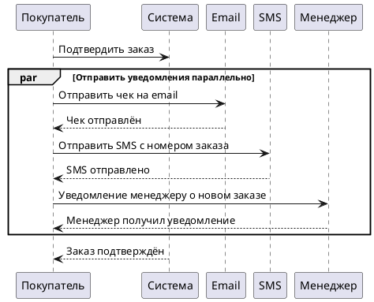

**Важно:** Все три уведомления (email, sms, менеджер) отправляются **одновременно**, а не последовательно. Фрейм `par` показывает это визуально.

---

### Вопрос 5: Когда использовать ref вместо дублирования логики?

**Ожидаемый ответ:**
Используйте `ref`, когда:
1. **Логика повторяется в нескольких диаграммах** — например, процесс оплаты используется при оформлении заказа, возврате товара и отмене заказа
2. **Нужно избежать дублирования кода** — рисовать один раз, ссылаться многократно
3. **Логика сложная** — лучше выделить её в отдельную диаграмму для читаемости

**Пример:**
```plantuml
@startuml
participant "Покупатель" as Buyer
participant "Сервис заказов" as OrderService
ref include: "process_payment.puml" as PaymentProcess

Buyer -> OrderService: Создать заказ
OrderService --> Buyer: Заказ создан

Buyer -> OrderService: Оплатить заказ
OrderService -> PaymentProcess: Инициировать оплату
PaymentProcess --> OrderService: Оплата завершена
OrderService --> Buyer: Подтверждение заказа
@enduml
```

**Преимущества:**
- Изменения в процессе оплаты применяются ко всем сценариям сразу
- Диаграммы остаются читаемыми (не нужно рисовать всю логику оплаты каждый раз)
- Избегаются противоречия (одна версия процесса оплаты для всех случаев)

---

**Итого:** Фреймы — это мощный инструмент для организации логики в Sequence-диаграммах. Понимание их различий и правильное применение делает диаграммы понятными, читаемыми и полезными для коммуникации с командой.